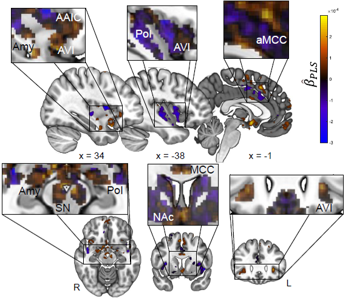

# A mesocorticolimbic signature of pleasure in the human brain
Summary and requirements:
-------------------------
This repository contains MATLAB scripts needed to produce key results found in Kragel et al. 2023. 
They have been tested using MATLAB 2016b and require [the CANLAB core tools](https://github.com/canlab/CanlabCore) and [SPM12](https://www.fil.ion.ucl.ac.uk/spm/software/spm12/).

The data used to develop the signature are available at https://osf.io/vs84r/

This code requires data available [here](https://osf.io/2znxp/). Download and unzip these data, and place them in the Data subdirectory (see [set_up_dirs_paths.m](https://github.com/ecco-laboratory/PMA/blob/main/set_up_dirs_paths.m) for details).

To run the analyses, add Canlab Core and SPM12 to the MATLAB path, navigate to the Code directory from the above link (and subfolders), and run [RunAnalysis.m](https://github.com/ecco-laboratory/PMA/blob/main/RunAnalysis.m). 

Test environment(s):
--------------------
MATLAB Version: 9.11.0.1769968 (R2021b)
MATLAB License Number: 300274
Operating System: Microsoft Windows 11 Pro Version 10.0 (Build 22621)
Java Version: Java 1.8.0_202-b08 with Oracle Corporation Java HotSpot(TM) 64-Bit Server VM mixed mode

